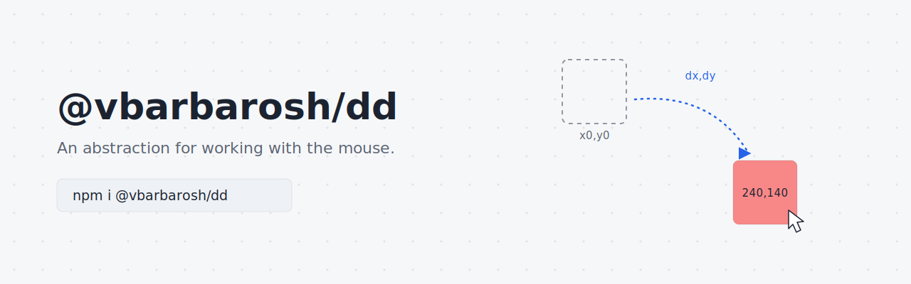

An abstraction for working with the mouse.

    dd({
        event, // Pass original event object in
        begin: function (ctx) {
            console.log('The beginning');
        },
        end: function (ctx) {
            console.log('The end');
        },
        move: function (ctx) {
            console.log(`Position: x=${ctx.x} y={ctx.y}; distance: dx=${ctx.dx} dy=${ctx.dy}`);
        },
    });

## Installation

    npm i @vbarbarosh/dd

## Using from browser

    

## Description

This abstraction comes from the following observations:

1) Each interaction with the mouse has the following workflow:

       mousedown -> mousemove ... mousemove -> mouseup

   (here is `context.begin`, `context.end`, and `context.move`).

2) Almost always what you are really looking for is
   *how far a mouse was moved from the beginning* (here is
   `context.dx` and `context.dy`).

3) In general, you have to work with 2 coordinate system:
   the screen coordinates, and local coordinates. And the
   only thing you are interested in is your local coordinates.
   Or, in other words, you have to convert coordinates from
   screen to local (here is `context.translate`).

## Threshold

Pass `threshold: n` to postpone `begin` until the pointer travels `n`
pixels away from the press point. Deltas keep measuring from the original
press point — there is no rebasing at the crossing point — so `begin`
fires with `dx`/`dy` ≈ threshold and a dragged item realigns with the
pointer grip instead of lagging behind by the threshold distance:

    dd({
        event,
        threshold: 5,
        begin: function (ctx) {
            // First call: ctx.dx/ctx.dy are already ≈ 5
        },
    });

`begin_nothreshold` and `end_nothreshold` handlers run unconditionally at
press and release, even when the threshold was never crossed.

## Gotchas

* To drag on touch devices, call `dd` from a `pointerdown` handler and
  set `touch-action: none` on the drag handle — otherwise the browser
  takes over the gesture for scrolling and cancels the pointer.
* `dd.no_pointer_events()` disables hit-testing for the whole page, so
  wheel events stop reaching scrollable containers — skip it when the
  user should be able to scroll a container mid-drag.
* `IFRAME` and `BUTTON[disabled]` stops propagation of mouse
  events. As a result `dd` will not call `begin` nor `update`
  handlers ([Events and disabled form fields](https://jakearchibald.com/2017/events-and-disabled-form-fields/)).

## Resources

* https://github.com/STRML/react-grid-layout
* https://github.com/STRML/react-draggable
* https://github.com/STRML/react-resizable
* https://github.com/AlexeyBoiko/DgrmJS
* https://www.youtube.com/watch?v=IEZ2bdMbSwI
* http://dbushell.github.io/Nestable
